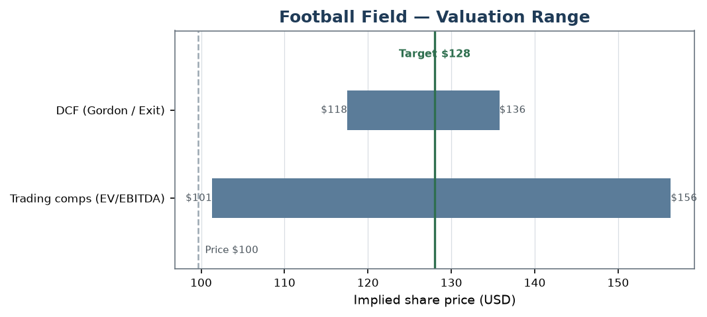
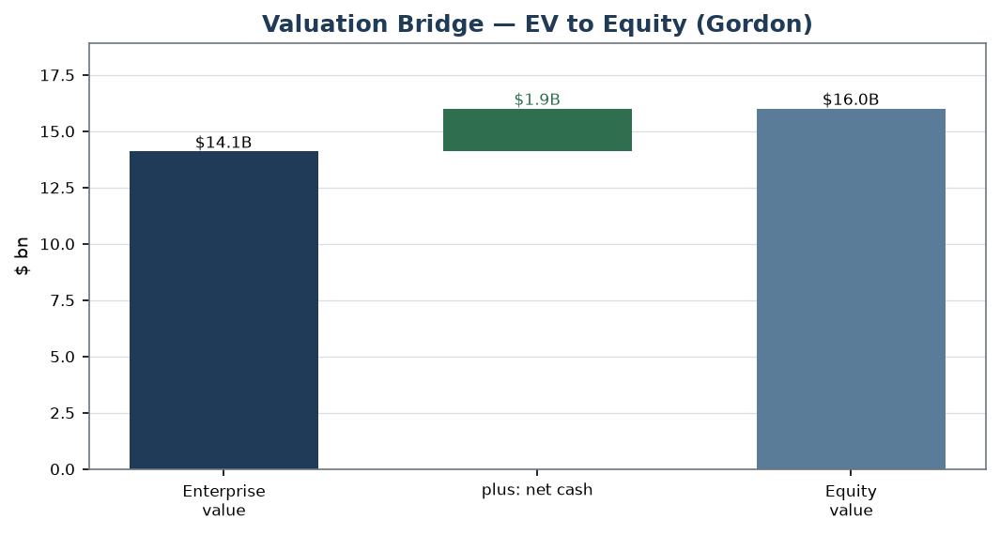

# thesis

[](https://github.com/billdmar/thesis/actions/workflows/ci.yml)
[](LICENSE)
[](pyproject.toml)

▶ **[Live summary](https://billdmar.github.io/thesis/)** ·
📄 **[Read the report (PDF)](https://github.com/billdmar/thesis/releases/latest/download/DECK_initiating_coverage.pdf)** ·
📊 **[Download the model (Excel)](https://github.com/billdmar/thesis/releases/latest/download/DECK_model.xlsx)**

**Initiating coverage of Deckers Outdoor (DECK): Buy, $128 price target, +28%.**
The market has oversold a net-cash, ~23%-operating-margin compounder on
*decelerating — not declining —* growth. Full initiating-coverage report, a
live-formula valuation model, and the thesis behind the call below.

*By **William Mar** · [LinkedIn](https://www.linkedin.com/in/williamdmar/) ·
Coverage as of 2026-08-06 — educational project, not investment advice.*

Behind the call: an SEC-EDGAR-driven valuation model (3-statement, DCF, trading
comps, precedent transactions, LBO), an institutional-format research-report PDF,
and a Python engine that builds **and verifies** both — every number traces back
to a SEC filing or a documented assumption, nothing hand-keyed.

## Headline

| | |
|---|---|
| **Rating** | **Buy** |
| **12-month price target** | **$128** |
| Current price (as-of 2026-08-06) | $99.68 |
| **Implied upside** | **+28%** |
| DCF fair value (Gordon / exit-11×) | $118 / $136 (mid ~$127) |
| Trading comps (peer median EV/EBITDA) | ~$129 |
| Scenarios (bear / base / bull) | ~$83 / ~$127 / ~$158 |
| WACC (net-cash ⇒ = cost of equity) | 9.55% |
| Illustrative LBO | IRR ~13.6% · MOIC ~1.9× |

*The DCF (~$127 mid) and comps (~$129) triangulate above the $99.68 price, while
a genuine bear — HOKA stalls to ~2% growth, margins revert toward the FY22
low-50s, multiple stuck at a trough 8× — lands near ~$83. So the setup is
asymmetric but not free: ~+27% to the target vs. ~−17% if the thesis breaks. The
thesis: the market has oversold a net-cash, ~23%-operating-margin compounder on
decelerating (not declining) growth. The DCF Gordon terminal is normalized to
steady state; the illustrative LBO's modest return honestly reflects that a
net-cash, high-multiple name is a poor leverage candidate.*

<p align="center">
  
  &nbsp;
  
</p>
<p align="center"><sub>Left: valuation range by method vs. price and target. Right:
EV → equity bridge (DECK's net cash is added back). Both generated by the engine;
see the full <a href="releases/DECK_initiating_coverage.pdf">report PDF</a> and
<a href="releases/DECK_model.xlsx">Excel model</a>.</sub></p>

## Deliverables
- 📊 **[`releases/DECK_model.xlsx`](releases/DECK_model.xlsx)** — the live-formula
  workbook (every computed cell is a formula, not a baked value).
- 📄 **[`releases/DECK_initiating_coverage.pdf`](releases/DECK_initiating_coverage.pdf)**
  — the initiating-coverage report (rating, target, thesis, valuation, risks).
- 🐍 `src/` — the engine + the verifier suite.

## Verification — why every number is trustworthy

Every figure in the report and model ties back to a SEC filing or a labeled
assumption — nothing is hand-keyed. Each deliverable is machine-verified against a
single Python reference engine:

- **XBRL tie-out** — **832/832** historical statement lines reconcile to
  SEC-reported facts **to the dollar**.
- **Excel↔Python differential** — the workbook is recalculated (via the
  `formulas` library) and **38 computed formula cells match the engine to the
  cent** — the full income-statement projection chain (revenue → EBIT → EBITDA →
  net income, per year), the WACC build, and the DCF valuation & EV→equity
  bridge. (Baked engine-output cells — net debt, comps/LBO results — are values,
  not formulas, and are excluded by design.)
- **Report-number lint** — every figure in every financial exhibit of the PDF is
  matched back to an engine output; a fabricated table number fails the build.
- **Excel audit** — banker conventions enforced: live formulas (no baked
  values) in computed regions, blue inputs only on the Assumptions tab, all 18
  named ranges present.
- **Accounting invariants** — balance sheet balances every period; cash-flow
  statement ties to balance-sheet cash; retained-earnings and PP&E rolls hold;
  LBO sources = uses and IRR recomputes independently.
- **Valuation sanity** — terminal g < WACC; sensitivities monotone; implied
  multiple sits inside the peer band.
- **Determinism** — a full rebuild from cached data reproduces identical
  numbers.
- **≥90% coverage** (gated in CI) — **~98% line coverage** on `src/`, **188
  tests**, green in CI on `ubuntu-latest` over committed fixtures (never live
  EDGAR).

## Architecture

```
SEC EDGAR XBRL CompanyFacts  ──►  src/edgar   (client + rate-limit + cache + tag normalization)
                                      │
                              NormalizedFacts (canonical line items, provenance, restatements)
                                      │
              src/statements ──►  3-statement model (historical + 5-yr projection, revolver plug)
                                      │
   ┌──────────────┬──────────────┬────┴────┬──────────────┬──────────────┐
 src/valuation  src/comps      src/lbo   src/scenarios  src/segments   (assumptions:
 (WACC,FCFF DCF)(peers,        (S&U,     (bull/base/    (HOKA/UGG      docs/
                 precedents)    IRR/MOIC) bear runner)   brand sales)  ASSUMPTIONS.md)
   └──────────────┴──────────────┴────┬────┴──────────────┴──────────────┘
                              ModelBundle (single source of truth)
                                      │
        ┌──────────────────────┬──────┴───────────┬────────────────────┐
   src/workbook            src/report          src/verify
   (live-formula xlsx)  (charts + PDF)   (recalc differential, audit, tie-out,
                                          invariants, report-lint)
```

## Quickstart
```bash
python3.12 -m venv .venv
.venv/bin/pip install -e ".[dev]"
.venv/bin/pytest -m "not live"                 # full suite on committed fixtures

# regenerate every deliverable from cached data (deterministic, one command):
.venv/bin/python scripts/build_deliverables.py  # → releases/, docs/index.html, docs/img/
```
macOS needs the WeasyPrint native libs for the PDF — see [`docs/ENV.md`](docs/ENV.md).

## Docs
- [`docs/ASSUMPTIONS.md`](docs/ASSUMPTIONS.md) — every assumption with sourced rationale.
- [`docs/DESIGN.md`](docs/DESIGN.md) · [`docs/WORKBOOK_SPEC.md`](docs/WORKBOOK_SPEC.md) · [`docs/REPORT_SPEC.md`](docs/REPORT_SPEC.md).

## Data & disclaimer
Built from public **SEC EDGAR** XBRL data used under the SEC's fair-access
policy (mandatory User-Agent, ≤10 req/s, cached; never live in CI), **without
implying SEC endorsement**. This is an **educational project, not investment
advice**; all projections are the author's assumptions, labeled as such.

## License
MIT — see [LICENSE](LICENSE).
